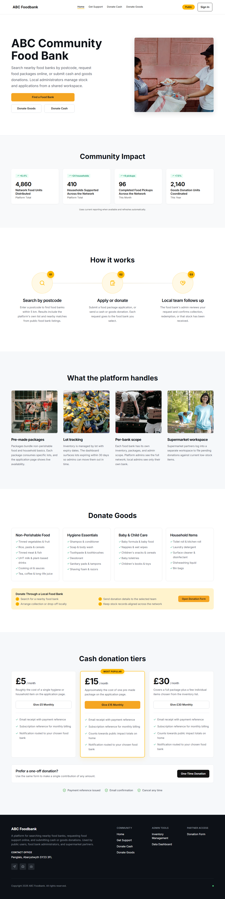
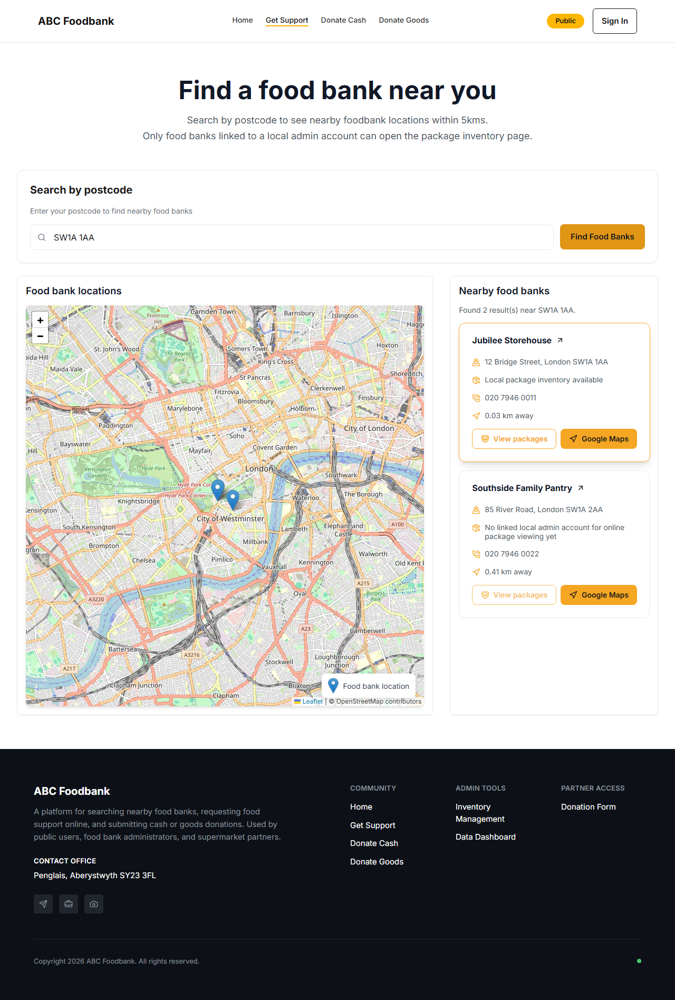
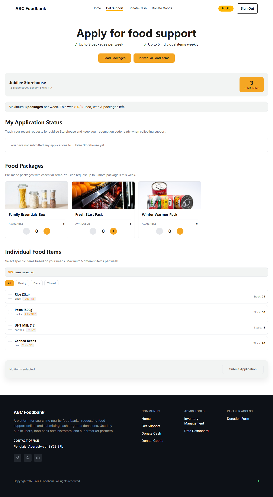
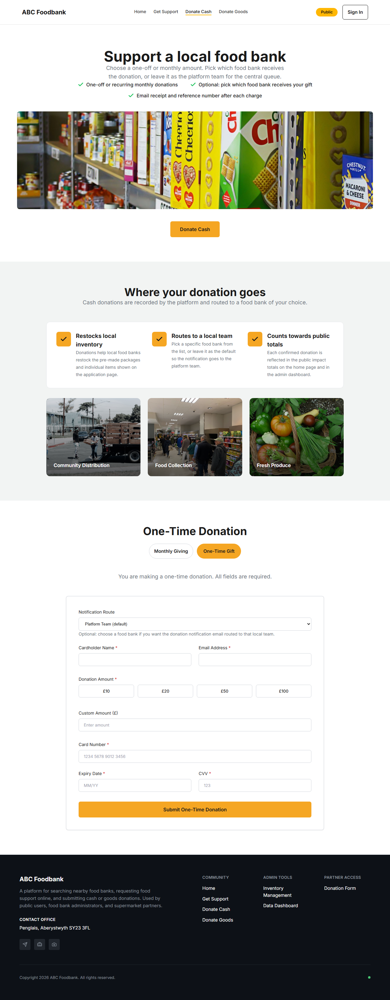
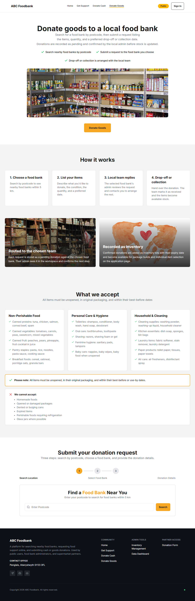
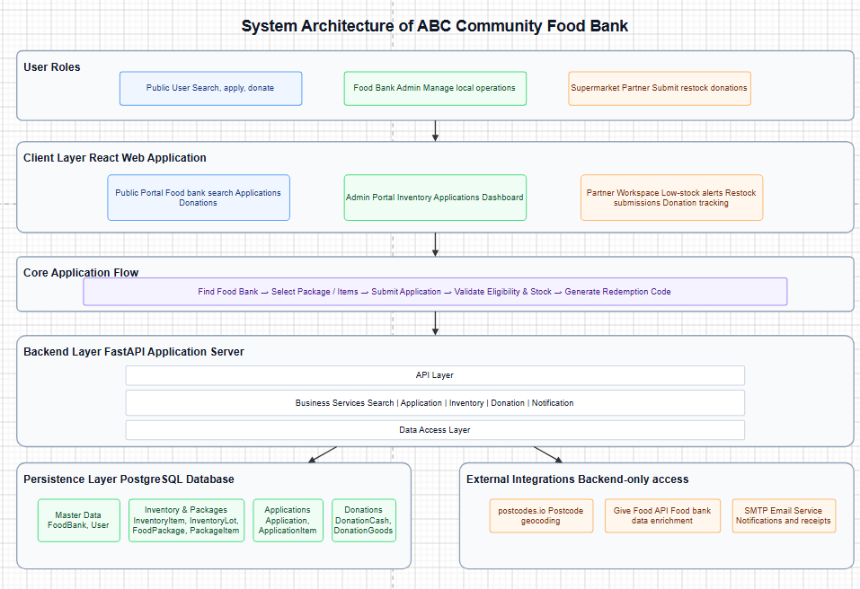

# ABC Community Food Bank

A full-stack web platform for running a community food bank network. It serves three
distinct user groups — members of the public, food-bank administrators, and supermarket
partners — through a single application with role-scoped permissions enforced on the
server.

The repository is a front-end / back-end monorepo:

- `frontend/` — React + TypeScript + Vite single-page app
- `backend/` — FastAPI + SQLAlchemy 2.0 Async API
- Data layer — PostgreSQL with Alembic migrations


## Overview

- Public site routes: `/home`, `/find-foodbank`, `/donate/cash`, `/donate/goods`, `/food-packages`
- Workspace routes: `/workspace?section=food|statistics|restock`
- User roles: `public`, `admin`, `supermarket`
- A "local admin" is not a separate role — it is a `role=admin` user whose JWT carries a
  `food_bank_id`, which scopes their data access to a single food bank.
- Authentication uses an access token only. The frontend persists the session to
  `localStorage` and re-validates it against `/api/v1/auth/me` on startup.
- The backend still starts when the database is unavailable, but enters a degraded mode
  and `/health` returns `503`.

## Features

### Public

- Home, Find a Food Bank, Cash Donation, Goods Donation, and Food Package application pages
- Registration, login, logout, forgotten password, and verification-code password reset
- Search nearby food banks by UK postcode and view their locations on a map
- Search results combine in-system food bank data with the external Give Food feed
- Cash donations support `one_time` and `monthly` schedules
- Goods donations support selecting a food bank, contact details, a drop-off date, and an itemised list
- Signed-in users can view food packages and individually claimable inventory items and submit an application
- A redemption code is generated on a successful application
- Application limits: up to 3 packages per week, up to 5 item types per week, and at most 5 units of a single item per application

### Admin

- **Inventory** — category management, stock-in, stock-out, low-stock alerts
- **Inventory Lots** — batches, expiry dates, waste status, lot-level adjustment and deletion
- **Donation Intake** — review cash and goods donations
- **Package Management** — list, view, create, edit, delete food packages, and pack them into stock
- **Applications** — back-office records, lookup by redemption code, redemption, and voiding
- **Data Dashboard** — analytics charts for donations, inventory, packages, expiry, and redemptions
- **Food Bank Management** — platform admins can create, edit, and delete food banks

### Supermarket

- Enter the supermarket workspace via `/workspace?section=restock`
- View low-stock alerts
- Submit a supermarket goods-donation form, which is recorded as a pending donation that an
  admin confirms before it enters the inventory flow

## Screenshots

All screenshots are of the running application.

| | |
| --- | --- |
| **Home** — public landing page with live network impact metrics | **Find a Food Bank** — postcode search with map and result cards |
| [](docs/images/home.png) | [](docs/images/find-foodbank.png) |
| **Food Packages** — authenticated package and item application | **Donate — Cash** — one-off and monthly giving flow |
| [](docs/images/food-packages.png) | [](docs/images/donate-cash.png) |
| **Donate — Goods** — public goods donation journey | |
| [](docs/images/donate-goods.png) | |

## Tech Stack

### Frontend

| Area | Implementation |
| --- | --- |
| Framework & language | React 18, TypeScript 5, Vite 5 |
| Routing | React Router 6 |
| State management | In-repo custom `createStore` hooks; selected state persisted to `localStorage` |
| Styling | CSS Modules, `src/styles/tokens.css`, `src/index.css` |
| Icons | `lucide-react` |
| Maps | Leaflet (used directly, not via React Leaflet) |
| Charts | Recharts plus an in-repo chart renderer |
| Networking | A `fetch`-based `apiClient` |
| Testing & tooling | Playwright, Vitest, ESLint |

### Backend

| Area | Implementation |
| --- | --- |
| Web framework | FastAPI, Uvicorn |
| Config & validation | Pydantic 2, `pydantic-settings`, `python-dotenv` |
| ORM & migrations | SQLAlchemy 2.0 Async, Alembic |
| Database | PostgreSQL |
| Drivers | `asyncpg`, `psycopg2-binary` |
| Authentication | PyJWT, FastAPI HTTP Bearer |
| Password security | Passlib with bcrypt |
| Email | `aiosmtplib`, `email-validator` |
| Testing | Pytest, httpx |

Notes:

- User primary keys and some model defaults rely on PostgreSQL's `pgcrypto` extension for
  `gen_random_uuid()`.
- On startup the application initialises dashboard history and starts a background task
  that expires stale applications.

## API Modules

| Module | Main paths | Purpose |
| --- | --- | --- |
| Health | `/`, `/health` | Service status and database health |
| Auth | `/api/v1/auth` | Register, login, forgot/reset password, logout, current user |
| Food Banks | `/api/v1/food-banks` | Food bank list, detail, postcode geocode, external feed, inventory items, admin CRUD |
| Food Packages | `/api/v1/packages`, `/api/v1/food-banks/{food_bank_id}/packages` | Package list, detail, create, edit, delete, pack |
| Applications | `/api/v1/applications` | Submit, my applications, back-office records, lookup by code, redeem, void |
| Donations | `/api/v1/donations` | Cash, goods, and supermarket donations; admin listing and maintenance |
| Inventory | `/api/v1/inventory` | Inventory categories, lots, stock in/out, low-stock |
| Stats | `/api/v1/stats/public-impact`, `/api/v1/stats/dashboard` | Public impact cards and admin dashboard analytics |

Interactive OpenAPI docs are served at `http://localhost:8000/docs`.

## Repository Layout

```text
foodbank/
├─ backend/      FastAPI app, SQLAlchemy models, Alembic migrations, tests, seed scripts
├─ frontend/     React app, pages and shared components, Playwright tests
├─ scripts/      Windows startup scripts and Bash/WSL helpers
├─ docs/         Architecture notes and database schema reference
├─ dev.env       Shared local-orchestration defaults (no secrets)
└─ README.md
```

## Architecture

This project uses a layered, front-end / back-end separated architecture. The frontend
renders pages, manages interaction state, validates forms, and displays maps and charts.
The backend exposes a single API surface and owns authentication, permissions, and all
business logic for inventory, donations, applications, and statistics. The frontend never
touches the database directly — it only calls the backend API. The backend centralises
authorisation, validation, exception handling, and transaction control, so every entry
point obeys the same business rules.

External services sit at the architecture boundary: the backend calls `postcodes.io` to
geocode postcodes, pulls the Give Food feed to supplement in-system food bank data, and
uses an SMTP service for password-reset, thank-you, and notification emails.



The platform is organised as a layered stack: user roles, the React client layer, a core
application flow, the FastAPI backend (API / business services / data access), the
PostgreSQL persistence layer, and backend-only external integrations.

## Getting Started

### Prerequisites

- PostgreSQL (with the `pgcrypto` extension available)
- Python 3.11+
- Node.js 18+

### 1. Prepare the database

Create a database and user. The defaults expected by `.env.example` are:

```text
Database: foodbank
User:     foodbank
Password: foodbank
Host:     localhost
Port:     5432
```

The application does not create tables on startup — migrations must be run first
(see step 2). The database must support the `pgcrypto` extension; migration
`20260326_0012_enable_extensions` enables it.

### 2. Run the backend

```bash
cd backend
copy .env.example .env        # macOS/Linux: cp .env.example .env
# Edit .env: set DATABASE_URL and generate a SECRET_KEY, e.g.
#   python -c "import secrets; print(secrets.token_urlsafe(32))"
pip install -r requirements.txt
alembic upgrade head
uvicorn app.main:app --reload
```

Default addresses:

- API: `http://localhost:8000`
- Docs: `http://localhost:8000/docs`
- Health: `http://localhost:8000/health`

### 3. Run the frontend

```bash
cd frontend
npm install
cp .env.example .env.local
# Edit .env.local if backend is not on localhost:8000
npm run dev
```

Default address: `http://localhost:5173`

In development the frontend proxies `/api` to the backend via Vite. For non-dev builds,
set `VITE_API_URL` to the API base URL.

### Windows convenience script

After the steps above are done once (`.env` created, dependencies installed, migrations
applied), `scripts\quick_start.bat` can start both services together: it reads `dev.env`,
checks prerequisites and database connectivity, starts the backend and waits for
`/health`, optionally seeds demo data, starts the frontend with the `/api` proxy, and
falls back to alternative ports if the defaults are taken. Stop everything with
`scripts\stop.bat`.

## Environment Variables

### `backend/.env`

Created from `backend/.env.example`. Key variables:

- `DATABASE_URL` — async PostgreSQL connection string
- `SECRET_KEY` — JWT signing key (generate a long random value; never commit the real key)
- `ALGORITHM`, `ACCESS_TOKEN_EXPIRE_MINUTES`
- `CORS_ORIGINS` — comma-separated frontend origins allowed to call the API
- `APP_NAME`, `DEBUG`
- `APPLICATION_EXPIRY_DAYS`, `APPLICATION_EXPIRY_CHECK_SECONDS` — application-expiry behaviour
- `SMTP_*`, `PLATFORM_OPERATIONS_EMAIL`, `OPERATIONS_NOTIFICATION_EMAIL` — optional email config

If SMTP variables are left unset, the forgotten-password flow is unavailable and
thank-you / notification emails are skipped gracefully.

### Root `dev.env`

`dev.env` holds local-orchestration defaults only (ports, hosts, `SEED_DEMO_DATA`, the
Vite proxy target) — no secrets. The backend reads `dev.env` first and then `backend/.env`,
so `backend/.env` overrides any shared default.

### `frontend/.env.local`

Create from `frontend/.env.example` when running locally.

- `VITE_API_URL` — public base URL of the backend API (for production builds)

## Deployment (production)

You can deploy frontend, backend, and PostgreSQL separately on common platforms
(for example: Vercel + Render/Railway/Fly + Neon/Supabase/Render Postgres) without code changes.

### 1) Deploy PostgreSQL

- Create a managed PostgreSQL database.
- Keep the connection string for backend `DATABASE_URL`.
- Ensure `pgcrypto` is available (migration `20260326_0012_enable_extensions` enables it).

### 2) Deploy backend (`backend/`)

Set environment variables:

- `DATABASE_URL`
- `SECRET_KEY` (strong random value)
- `CORS_ORIGINS` (comma-separated or JSON list of frontend origins)
- Optional: `SMTP_*`, `PLATFORM_OPERATIONS_EMAIL`, `OPERATIONS_NOTIFICATION_EMAIL`

Start command:

```bash
alembic upgrade head && uvicorn app.main:app --host 0.0.0.0 --port ${PORT:-8000}
```

Container option:

- `backend/Dockerfile` is ready for Docker-based deployments (Render/Railway/Fly/etc).

### 3) Deploy frontend (`frontend/`)

Set build environment variable:

- `VITE_API_URL=https://<your-backend-domain>`

Build/start commands:

```bash
npm ci
npm run build
npm run preview -- --host 0.0.0.0 --port ${PORT:-4173}
```

Container option:

- `frontend/Dockerfile` serves the built app with Nginx and includes SPA route fallback.

### 4) Wire domains

- Add your frontend URL(s) to backend `CORS_ORIGINS`.
- Confirm backend health at `https://<backend-domain>/health`.
- Open the frontend URL and verify login/API flows.

## Demo Data

When `SEED_DEMO_DATA=true` and the database is reachable, `quick_start.bat` seeds demo
data automatically. It can also be seeded manually:

```bash
cd backend
python scripts/seed_demo_data.py
```

Default demo accounts:

| Role | Email | Password | Notes |
| --- | --- | --- | --- |
| Platform Admin | `admin@foodbank.com` | `admin123` | Platform-wide admin |
| Supermarket | `supermarket@foodbank.com` | `supermarket123` | Supermarket partner |
| Public User | `user@example.com` | `user12345` | Member of the public |
| Local Admin | `localadmin@foodbank.com` | `localadmin123` | Scoped to `Jubilee Storehouse` |
| Local Admin | `local1admin@foodbank.com` | `local1admin123` | Scoped to `Westside Food Support Centre` |

Default demo food banks: `Jubilee Storehouse`, `Westside Food Support Centre`,
`Southbank Foodbank Hub`.

## Testing

### Backend

```bash
cd backend
pip install -r requirements-dev.txt
pytest
```

### Frontend

```bash
cd frontend
npm run lint
npm run test:unit
```

### Playwright end-to-end

```bash
cd frontend
npm run test:e2e
npm run test:e2e:smoke
npm run test:e2e:visual
```

The Playwright suite starts its own Vite server and mocks `/api/v1/**`, external images,
and map tiles, so the front-end E2E tests do not require a running backend.

## Implementation Notes

- Authentication issues an access token only; there is no refresh-token endpoint.
- Local-admin permissions are enforced by a `food_bank_id` scope; platform admins have no scope.
- Inventory is tracked per lot and consumed FEFO (first-expired, first-out); expired lots
  do not count towards available stock.
- Packing a package consumes the corresponding lots and records the consumption trail.
- Submitting an application generates a redemption code; the back office supports
  redemption and voiding.
- A background task expires stale applications based on a configurable day threshold.
- Find a Food Bank depends on `postcodes.io` and Give Food; if the external network is
  unavailable, postcode search and the external feed degrade gracefully.

## Further Documentation

- [`docs/architecture/BACKEND_IMPLEMENTATION.md`](docs/architecture/BACKEND_IMPLEMENTATION.md)
- [`docs/DATABASE_SCHEMA_CURRENT.md`](docs/DATABASE_SCHEMA_CURRENT.md)

## License

Released under the [MIT License](LICENSE).
